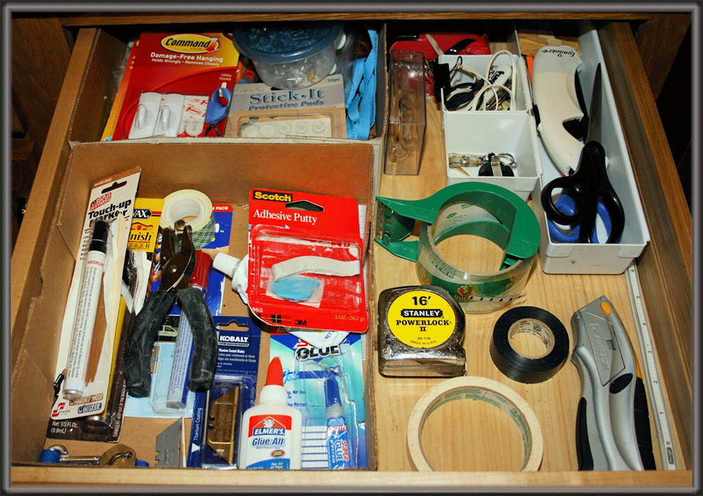

# Welcome to Developer Support
=========================

This is a place to collaborate and support GIS developers working with Esri's developer libraries.

Resources for troubleshooting as well as proof of concept samples to support developers!
Much of the code contained here is samples created by Esri staff to help developers understand how to program against all aspects of Esri’s Location Platform – desktop, mobile devices and for the web.  It’s a great place to copy and paste code you may need or search for lesser-known methods or classes to see how they are implemented.  Despite the name however, this repository is not intended as a place to replace community and paid support offered by Esri.  For community support, check out our [Esri’s GeoNet site](https://geonet.esri.com/welcome).  For paid support check out [http://support.esri.com](http://support.esri.com) or contact your regional distributor.

## Using the samples

The easiest way to use these samples without using Git is to download the zip file for this repository. The **Download Zip** link can be found in the top right of the repository by clicking the green **Clone or download** button.

###### Notes:

* The resulting zip archive will contain ALL samples for this repository.

* In Windows, before you unzip, you may need to unblock the archive.  Right-click the zip file, select **Properties**, then select **Unblock**.

* The general organization of the repository is:  **[Technology Platform]-[Language]/[Sample Name]**

* Many of the samples will require installation of supporting software (e.g. a respective SDK). See the sample readme for dependencies.

For more information regarding the technology platforms, languages, APIs, and SDKs, please refer to the documentation at: [ArcGIS for Developers - Documentation](https://developers.arcgis.com/documentation/#extending-the-arcgis-platform)

## Contributing

Esri welcomes contributions from anyone and everyone. Please do not contribute code you did not write yourself, unless you are certain you have the legal ability to do so. Also ensure all code contributed can be licensed under the Apache License 2.0. For more details please see our [guidelines for contributing](https://github.com/Esri/developer-support/blob/master/CONTRIBUTING.md).

## Licensing
©2015-2019 Esri

Licensed under the Apache License, Version 2.0 (the "License");
you may not use this file except in compliance with the License.
You may obtain a copy of the License at

   http://www.apache.org/licenses/LICENSE-2.0

Unless required by applicable law or agreed to in writing, software
distributed under the License is distributed on an "AS IS" BASIS,
WITHOUT WARRANTIES OR CONDITIONS OF ANY KIND, either express or implied.
See the License for the specific language governing permissions and
limitations under the License.

A copy of the license is available in the repository's [LICENSE](/LICENSE) file.

## Welcome to our toolbox!

## Esri Staff

To get involved, you have two options:

1. if you currently work in tech support and prefer to get familiar with GitHub using the [fork and pull](https://guides.github.com/activities/forking/) model, you can contribute as much as you please (just like the rest of planet 🌏) . some people like doing things this way because they know they can't do any harm when they don't have permission to push their own code upstream.

2. that said, we **do** want to encourage more folks to take on a maintainer role. so we highly recommend that you [<kbd>Request to join</kbd>](https://github.com/orgs/Esri/teams/apps-group/members) the [Support Services](https://github.com/orgs/Esri/teams/support-services) team to start upping your game and get _push_ access.

the only prerequisites are: 
* you have to be currently employed by Esri
* you must have already reviewed someone elses pull request or submitted one of your own (even if its just a simple typo fix).
