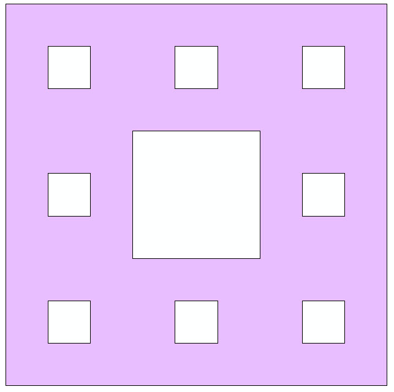
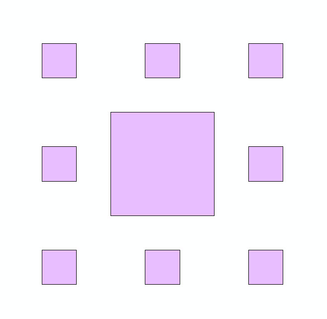
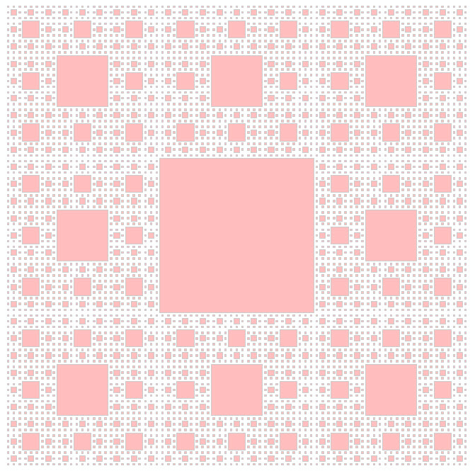

#Create ST Geometry in Oracle 12c
This sample script demonstrates how to connect to Oracle and insert st geometry using python and SQL. For fun, the sample creates polygons from the sierpinski carpet.

The sierpinski object may be used to create two tables. 

The first table is a representation of the sierpinski carpet:


The second table contains the squares removed from the carpet:


##Testing Environment
- Oracle 12c
- ArcGIS for Desktop 10.3.1 
- Python 2.7

##Steps:
1. Install cx_Oracle module
1. Change the connection string, tablename, span (xmin and ymax) and number of iterations at the bottom of the script.
1. Run the script!

```python
#Parameters to change.
connection ="connection-string" #i.e. dataowner/dataowner@instance/sid
tablename = "sierpinski"
span = [0, 90]
iterations = 1
```

##Limitations:
- If the number of iterations is greater than 1, the sierpinski carpet will not be created as the text string will be too long to create the one polygon. However, the intermediate table will still be available to view. For example, an itermediate table with iterations set to 4:

- For the geometry to be drawn correctly, ymax > xmin in the span.
- This only works for a spatial reference wkid of 4326.

##Additional Information:
- The geometry type is ST_Geometry. ST_UNION and ST_DIFFERENCE were used to create the carpet.
- ST_DIFFERENCE: http://desktop.arcgis.com/en/arcmap/10.3/manage-data/using-sql-with-gdbs/st-difference.htm
- ST_UNION: http://desktop.arcgis.com/en/arcmap/10.3/manage-data/using-sql-with-gdbs/st-union.htm